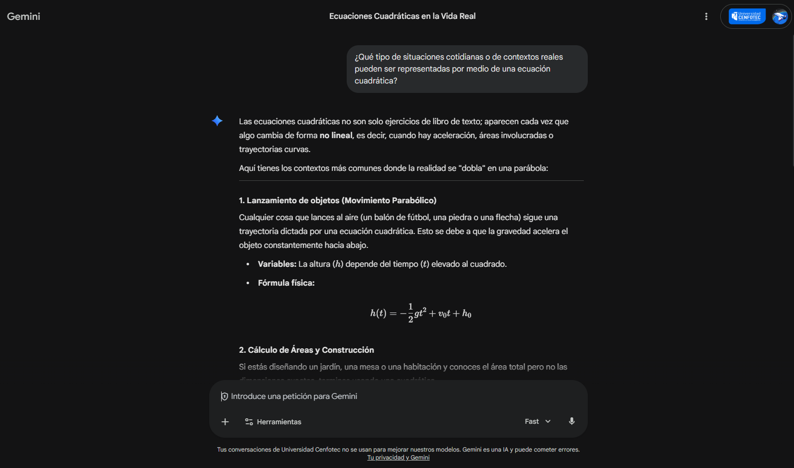

# Semana 10 - Interacción con DiálogoX
## Módulo 4. Parte II. Ecuaciones e Inecuaciones

### Interacción realizada

**¿Qué tipo de situaciones cotidianas o de contextos reales pueden ser representadas por medio de una ecuación cuadrática?**

---

### Respuesta proporcionada por DiálogoX

Las ecuaciones cuadráticas no son solo ejercicios de libro de texto; aparecen cada vez que algo cambia de forma no lineal, es decir, cuando hay aceleración, áreas involucradas o trayectorias curvas.

Aquí tienes los contextos más comunes donde la realidad se "dobla" en una parábola:

---

#### 1. Lanzamiento de objetos (Movimiento Parabólico)

Cualquier cosa que lances al aire (un balón de fútbol, una piedra o una flecha) sigue una trayectoria dictada por una ecuación cuadrática. Esto se debe a que la gravedad acelera el objeto constantemente hacia abajo.

**Variables:** La altura (h) depende del tiempo (t) elevado al cuadrado.

**Fórmula física:**

h(t) = −½ g t² + v₀ t + h₀

---

#### 2. Cálculo de Áreas y Construcción

Si estás diseñando un jardín, una mesa o una habitación y conoces el área total pero no las dimensiones exactas, terminas usando una cuadrática.

**Ejemplo:** "Quiero un marco para un cuadro donde el largo sea el doble del ancho y el área total sea de 500 cm²". Al multiplicar x por 2x, obtienes 2x² = 500, lo cual es una forma simple de ecuación cuadrática.

---

#### 3. Optimización de Ganancias en Negocios

En economía, existe un punto "dulce". Si vendes un producto muy barato, vendes mucho pero ganas poco. Si lo vendes muy caro, no vendes nada. El beneficio suele seguir una curva en forma de "U" invertida.

**Contexto:** Encontrar el precio ideal para maximizar los ingresos.

**La ecuación:** Relaciona el precio de venta con la demanda y los costos de producción.

---

#### 4. La Forma de la Tecnología (Antenas y Faros)

Las antenas parabólicas y los espejos de los faros de los autos tienen esa forma por una razón matemática. Las propiedades de la parábola permiten que todas las señales que chocan con ella se concentren en un solo punto (el foco).

**Uso real:** Sin ecuaciones cuadráticas, no tendríamos señales de satélite precisas ni linternas potentes.

---

#### 5. Seguridad Vial (Distancia de Frenado)

Cuando un conductor pisa el freno, la distancia que recorre el auto antes de detenerse no aumenta de forma lineal con la velocidad, sino de forma cuadrática.

**Realidad:** Si duplicas tu velocidad, tu distancia de frenado no se duplica, ¡se cuadruplica! Por eso el exceso de velocidad es tan peligroso; la energía cinética depende de v².

---

#### Resumen de elementos clave

Para identificar una situación cuadrática en la vida real, busca estas tres "pistas":

- **Aceleración/Gravedad:** El tiempo está involucrado dos veces.
- **Áreas:** Multiplicas dos dimensiones (largo x ancho).
- **Trayectorias curvas:** Formas de arco o puentes colgantes.

---

### Reflexión personal

Antes de esta investigación, pensaba que las ecuaciones cuadráticas eran simplemente un tema más de matemáticas sin aplicación práctica directa. Me sorprendió descubrir que están presentes en tantas áreas diferentes, desde el simple lanzamiento de una pelota hasta la optimización de ganancias en un negocio.

Lo que más me llamó la atención fue el tema de la distancia de frenado, porque es algo que afecta la seguridad vial y detrás hay una ecuación cuadrática. También me parece muy útil la aplicación en el cálculo de áreas, especialmente para quienes trabajan en construcción o diseño de espacios.

---

### Evidencia visual de la interacción

