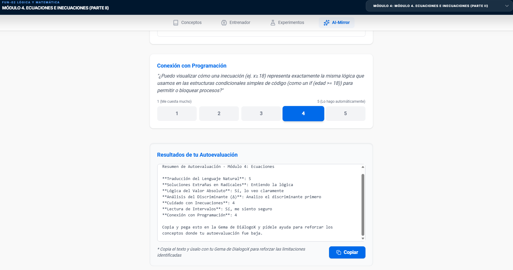
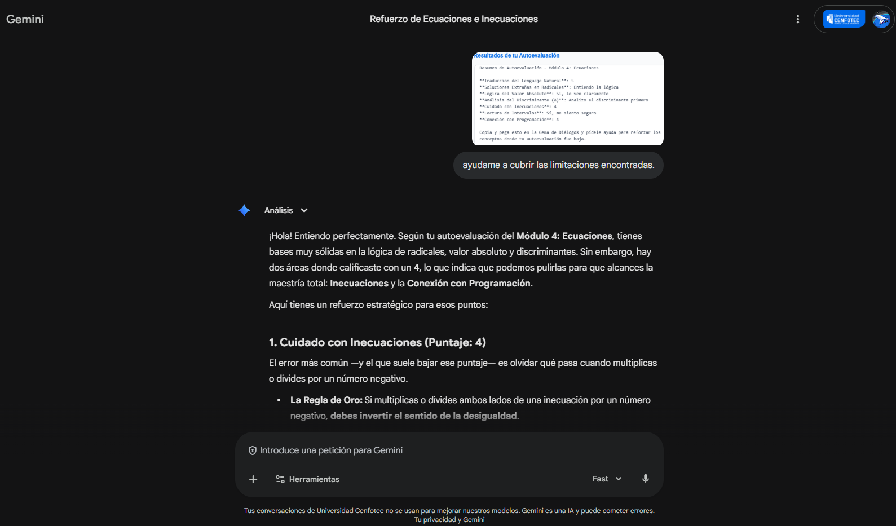

# Semana 10 – Autoevaluación AI-Mirror
## Módulo 4. Parte II. Ecuaciones e Inecuaciones

---

## Indicación

Responder las preguntas metacognitivas del IA-Mirror del AI Studio en el "Módulo 4. Parte II. Ecuaciones e Inecuaciones". Tomar un pantallazo de la autoevaluación y dársela a la Gema de DiálogoX solicitándole que ayude a cubrir las limitaciones encontradas.

---

## Evidencia del AI-Mirror



---

## Respuesta de DiálogoX para cubrir limitaciones

Según la autoevaluación del Módulo 4, se identificaron dos áreas principales donde se puede mejorar: **Inecuaciones** y la **Conexión con Programación**.

### 1. Cuidado con Inecuaciones

El error más común es olvidar qué pasa cuando multiplicas o divides por un número negativo.

**La Regla de Oro:** Si multiplicas o divides ambos lados de una inecuación por un número negativo, debes **invertir el sentido de la desigualdad**.

**Ejemplo:** −2x < 10 ⟹ x > −5 (Cambiamos < por >).

**Inecuaciones Cuadráticas:** No se resuelven despejando como una ecuación lineal. Debes encontrar los "puntos críticos" y evaluar intervalos.

Para x² − 4 > 0, primero factorizas (x − 2)(x + 2) > 0. Los puntos son 2 y −2. Luego pruebas valores en los intervalos (−∞, −2), (−2, 2) y (2, ∞) para ver dónde se cumple la condición.

### 2. Conexión con Programación

En el código, las ecuaciones e inecuaciones son el corazón de la lógica de control y los algoritmos.

**Inecuaciones como Condicionales (if):**
Una inecuación es esencialmente un valor booleano. Cuando escribes `if (usuario_edad >= 18)`, estás aplicando una inecuación lineal en el mundo real.

**El Discriminante (Δ) en código:**
En programación, no solo calculamos Δ, lo usamos para evitar errores de ejecución (como intentar sacar la raíz cuadrada de un número negativo).

```python
delta = b**2 - 4*a*c
if delta < 0:
    print("La solución es compleja/imaginaria")
else:
    # Proceder con la fórmula general
```

**Optimización:** Resolver una ecuación algebraicamente antes de programarla ahorra ciclos de CPU. En lugar de que la computadora "adivine" un valor con un bucle, le das la fórmula despejada.

---

## Reflexión personal

Esta autoevaluación me permitió identificar que mis bases en ecuaciones cuadráticas, radicales y valor absoluto son sólidas, pero necesito reforzar el manejo de inecuaciones, especialmente el cambio de signo al dividir por negativos. La conexión con programación me pareció muy valiosa, ya que me ayuda a ver las matemáticas no como algo abstracto sino como herramientas directamente aplicables a mi carrera.

---

## Evidencia de DiálogoX ayudando con limitaciones


