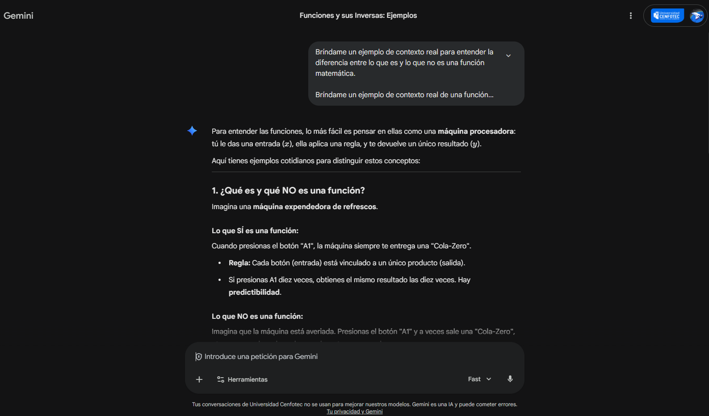

# Semana 11 - Interacción con DiálogoX
## Módulo 5. Funciones (Parte I)

### Interacción realizada

**Pregunta 1: Bríndame un ejemplo de contexto real para entender la diferencia entre lo que es y lo que no es una función matemática.**

**Pregunta 2: Bríndame un ejemplo de contexto real de una función que posea inversa, ¿cómo se usaría la función y cómo se usaría su inversa?**

---

### Respuesta proporcionada por DiálogoX

Para entender las funciones, lo más fácil es pensar en ellas como una **máquina procesadora**: tú le das una entrada (x), ella aplica una regla, y te devuelve un **único resultado** (y).

---

#### 1. ¿Qué es y qué NO es una función?

Imagina una máquina expendedora de refrescos.

**Lo que SÍ es una función:**
Cuando presionas el botón "A1", la máquina siempre te entrega una "Cola-Zero".

- **Regla:** Cada botón (entrada) está vinculado a un único producto (salida).
- Si presionas A1 diez veces, obtienes el mismo resultado las diez veces. Hay predictibilidad.

**Lo que NO es una función:**
Imagina que la máquina está averiada. Presionas el botón "A1" y a veces sale una "Cola-Zero", otras veces sale un jugo de naranja y otras veces sale agua.

- **Fallo:** Una sola entrada (botón A1) genera múltiples salidas diferentes.
- En matemáticas, si para un valor de x existen dos o más valores de y, **no es una función**.

---

#### 2. Función Inversa: El contexto de la Conversión de Moneda

Una función tiene inversa cuando es "biunívoca"; es decir, a cada entrada le corresponde una salida única, y viceversa (nadie comparte el mismo resultado).

**El contexto: Viaje de negocios (Dólares a Euros)**
Imagina que viajas de Estados Unidos a España. La tasa de cambio es fija (por simplificación): 1 USD = 0.90 EUR.

---

**A. La Función Directa f(x)**

La usas cuando llegas a España y quieres saber cuántos euros recibirás por tus dólares.

**Fórmula:** f(x) = 0.90x

**Uso:** Tienes 100 dólares. Aplicas la función: 0.90 × 100 = 90. Recibes **90 euros**.

---

**B. La Función Inversa f⁻¹(y)**

La usas cuando estás por regresar a casa. Te sobraron billetes de euro y quieres saber cuántos dólares te devolverán. La inversa "deshace" el camino.

**Fórmula:** f⁻¹(y) = y / 0.90

**Uso:** Te sobraron 90 euros. Aplicas la inversa: 90 / 0.90 = 100. Recuperas tus **100 dólares**.

---

**Resumen de uso:**
- **Función:** Transforma la materia prima (dólares) en producto (euros).
- **Inversa:** Te permite regresar del producto (euros) a la materia prima original (dólares) de forma exacta.

---

### Reflexión personal

Estas dos preguntas me ayudaron a comprender de forma más clara y concreta qué es una función y qué no lo es. El ejemplo de la máquina expendedora es muy intuitivo porque es algo que usamos frecuentemente y nos permite visualizar la regla de unicidad de manera natural.

En cuanto a la función inversa, el ejemplo de la conversión de moneda me pareció muy práctico porque muestra que las funciones inversas no son solo un concepto abstracto, sino que tienen aplicaciones directas en la vida cotidiana. Entender que "deshacer" una operación matemática es posible gracias a que la función original es biyectiva me da una perspectiva más sólida sobre este tema.

---

### Evidencia visual de la interacción

