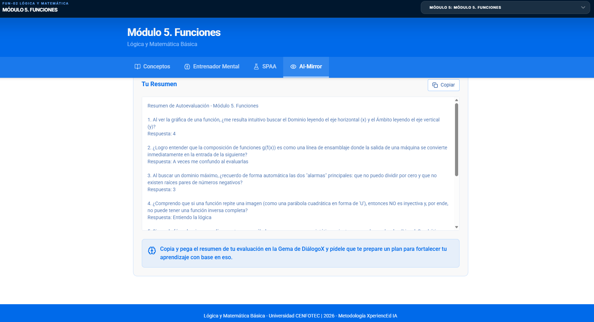
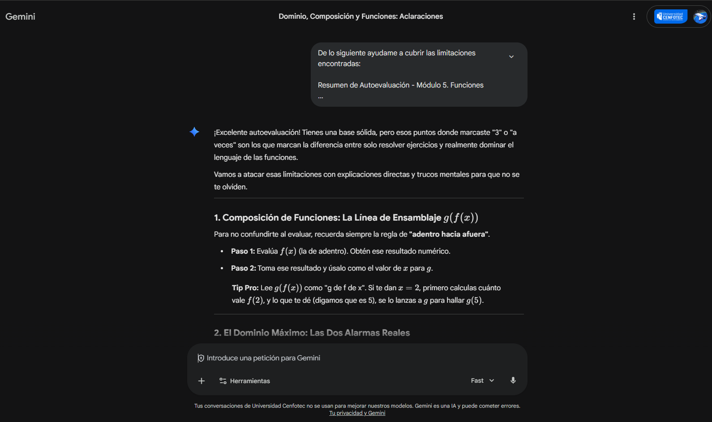

# Semana 12 – Autoevaluación AI-Mirror
## Módulo 5. Funciones (parte II)

---

## Indicación

Responder las preguntas metacognitivas del IA-Mirror del AI Studio en el "Módulo 5. Funciones". Tomar un pantallazo de la autoevaluación y dársela a la Gema de DiálogoX solicitándole que ayude a cubrir las limitaciones encontradas.

---

## Evidencia del AI-Mirror



---

## Resumen de Autoevaluación - Módulo 5. Funciones

1. **Al ver la gráfica de una función, ¿me resulta intuitivo buscar el Dominio leyendo el eje horizontal (x) y el Ámbito leyendo el eje vertical (y)?** → **4**

2. **¿Logro entender que la composición de funciones g(f(x)) es como una línea de ensamblaje?** → **A veces me confundo al evaluarlas**

3. **Al buscar un dominio máximo, ¿recuerdo las dos "alarmas" principales: no dividir por cero y no tener raíces pares de negativos?** → **3**

4. **¿Comprendo que si una función repite una imagen, NO es inyectiva y no puede tener inversa completa?** → **Entiendo la lógica**

5. **¿Puedo nombrar funciones por su forma visual (Lineal, Cuadrática, Exponencial/Logarítmica)?** → **3**

6. **¿Me queda claro por qué el signo de 'a' dicta si la parábola tiene mínimo o máximo?** → **Dudo a veces**

7. **¿Conecto que f(x)=y es idéntico a una función en programación?** → **3**

---

## Respuesta de DiálogoX para cubrir limitaciones

### 1. Composición de Funciones: La Línea de Ensamblaje g(f(x))

Para no confundirte al evaluar, recuerda siempre la regla de **"adentro hacia afuera"**.

- **Paso 1:** Evalúa f(x) (la de adentro). Obtén ese resultado numérico.
- **Paso 2:** Toma ese resultado y úsalo como el valor de x para g.

**Tip Pro:** Lee g(f(x)) como "g de f de x". Si te dan x = 2, primero calculas cuánto vale f(2), y lo que te dé (digamos que es 5), se lo lanzas a g para hallar g(5).

### 2. El Dominio Máximo: Las Dos Alarmas Reales

- **Denominadores:** Lo de abajo **jamás** puede ser 0. Toma el denominador, iguálalo a cero y esos números son los que debes expulsar del dominio.

- **Raíces Pares (√, ⁴√):** Lo de adentro debe ser **mayor o igual a cero**. Resuelve la inecuación argumento ≥ 0.

### 3. Identificación Visual de Funciones

| Forma Visual | Nombre | Comportamiento Clave |
|---|---|---|
| Línea Recta | Lineal | Crece o decrece a ritmo constante. |
| Forma de "U" o "∩" | Cuadrática | Tiene un punto de retorno (vértice). |
| Curva que "explota" hacia arriba | Exponencial | Crece cada vez más rápido; nunca toca el eje horizontal. |
| Curva que se "aplana" lentamente | Logarítmica | Es la inversa de la exponencial; nunca toca el eje vertical. |

### 4. Concavidad de la Cuadrática: El Coeficiente 'a'

Usa la técnica de la **"cara"**:

- Si **a > 0** (positivo): Es una **sonrisa** ∪. El vértice es el punto más bajo (**Mínimo**).
- Si **a < 0** (negativo): Es una **tristeza** ∩. El vértice es el punto más alto (**Máximo**).

### 5. La Conexión con Programación: f(x) = y

- **Dominio = Data Types o Input Constraints.** Si tu función espera un Integer, no puedes pasarle un String. Eso es el dominio: los valores permitidos de entrada.
- **Codominio/Ámbito = Return Type.** Es lo que la función promete devolverte.

```python
# Ejemplo matemático: f(x) = x * 2
def f(x):
    return x * 2

# Evaluar g(f(x)) es:
resultado_f = f(5)
resultado_final = g(resultado_f)
```

---

## Reflexión personal

Esta autoevaluación me ayudó a identificar que mis áreas de mejora están en la composición de funciones, la identificación visual rápida de tipos de funciones y la conexión entre dominio máximo y las restricciones matemáticas. Los trucos mentales como la "cara" para la concavidad y la regla de "adentro hacia afuera" para la composición son herramientas que planeo usar en futuros ejercicios. La conexión con programación me resulta especialmente valiosa, ya que me permite ver las funciones desde mi área de estudio.

---

## Evidencia de DiálogoX ayudando con limitaciones


