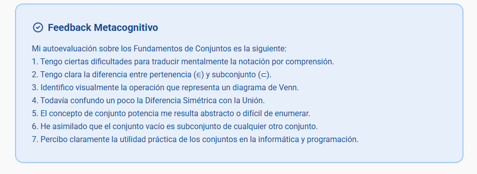

# Semana 2 — Autoevaluación AI-Mirror
## Módulo 3. Fundamentos de conjuntos (Parte I)

---

## Evidencia del resultado

---

### Fortalezas

- Comprendo la diferencia entre pertenencia (∈) y subconjunto (⊂).
- Identifico correctamente operaciones en diagramas de Venn.
- Entiendo que el conjunto vacío es subconjunto de cualquier conjunto.
- Percibo claramente la utilidad práctica de los conjuntos en informática.

### Áreas de mejora

- Traducir con mayor seguridad la notación por comprensión.
- Diferenciar con mayor claridad la unión y la diferencia simétrica.
- Enumerar correctamente el conjunto potencia cuando aumenta el número de elementos.