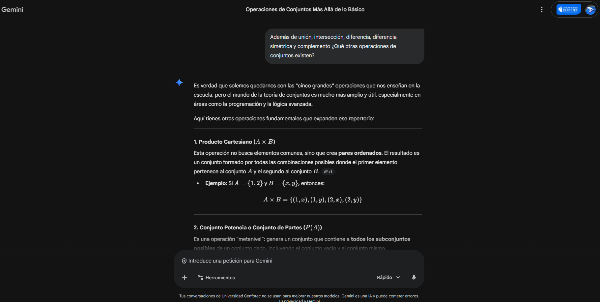

# Semana 3 — Interacción con DiálogoX
## Tema: Operaciones avanzadas en teoría de conjuntos

### Pregunta realizada
**Además de unión, intersección, diferencia, diferencia simétrica y complemento ¿Qué otras operaciones de conjuntos existen?**

---

## Respuesta proporcionada por DiálogoX

Es verdad que solemos quedarnos con las "cinco grandes" operaciones que nos enseñan en la escuela, pero el mundo de la teoría de conjuntos es mucho más amplio y útil, especialmente en áreas como la programación y la lógica avanzada.

Aquí tienes otras operaciones fundamentales que expanden ese repertorio:

### 1. Producto Cartesiano ($A \times B$)

Esta operación no busca elementos comunes, sino que crea pares ordenados. El resultado es un conjunto formado por todas las combinaciones posibles donde el primer elemento pertenece al conjunto $A$ y el segundo al conjunto $B$.

Ejemplo:  
Si $A = \{1, 2\}$ y $B = \{x, y\}$, entonces:

$$A \times B = \{(1, x), (1, y), (2, x), (2, y)\}$$

---

### 2. Conjunto Potencia ($P(A)$)

Genera un conjunto que contiene todos los subconjuntos posibles de un conjunto dado, incluyendo el conjunto vacío y el conjunto mismo.

Regla: Si un conjunto tiene $n$ elementos, su conjunto potencia tiene $2^n$ elementos.

Ejemplo:

$$P(\{1,2\}) = \{\emptyset, \{1\}, \{2\}, \{1,2\}\}$$

---

### 3. Diferencia Relativa vs Complemento Absoluto

- Diferencia Relativa ($A \setminus B$): Elementos en $A$ que no están en $B$.
- Complemento Absoluto ($A^c$): Elementos que no están en $A$ dentro del conjunto universal.

---

### 4. Unión Disjunta ($A \sqcup B$)

Permite unir conjuntos conservando el origen de los elementos. Es útil cuando se necesita distinguir de qué conjunto proviene cada elemento.

---

### 5. Partición de un conjunto

División de un conjunto en subconjuntos que:
- No estén vacíos.
- No tengan intersección entre sí.
- Su unión sea el conjunto original.

---

### Resumen comparativo

| Operación | Símbolo | Resultado |
|-----------|---------|-----------|
| Producto Cartesiano | × | Pares ordenados |
| Conjunto Potencia | P(A) | Todos los subconjuntos |
| Unión Disjunta | ⊔ | Unión preservando origen |
| Partición | — | División en subconjuntos disjuntos |

---

## Evidencia visual de la interacción

---

## Reflexión personal

En esta interacción amplié mi comprensión sobre operaciones que no suelen enseñarse en los niveles básicos. 

Comprendí especialmente la importancia del producto cartesiano en bases de datos y del conjunto potencia en análisis de algoritmos. 

Estas operaciones permiten entender estructuras más complejas dentro de la computación y fortalecen el razonamiento lógico avanzado.
