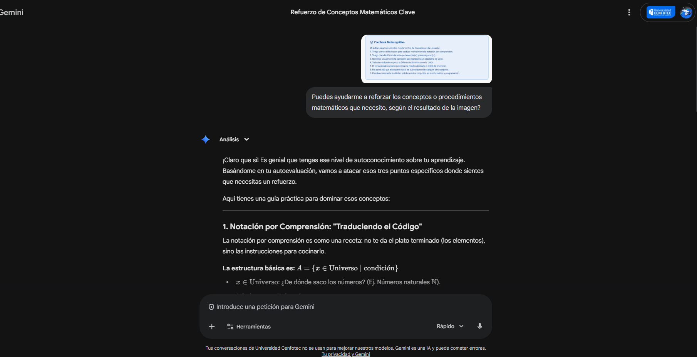

# Semana 3 — Autoevaluación AI-Mirror
## Módulo 3. Fundamentos de conjuntos

---

## Indicación

Se tomó el resultado de la autoevaluación realizada en AI-Mirror (AI Studio) y se entregó a la Gema de DiálogoX, solicitando refuerzo en los conceptos donde se identificaron debilidades.

---

## Respuesta proporcionada por DiálogoX

¡Claro que sí! Es genial que tengas ese nivel de autoconocimiento sobre tu aprendizaje. Basándome en tu autoevaluación, vamos a atacar esos tres puntos específicos donde sientes que necesitas un refuerzo.

Aquí tienes una guía práctica para dominar esos conceptos:

---

### 1. Notación por Comprensión: "Traduciendo el Código"

La notación por comprensión es como una receta: no te da el plato terminado (los elementos), sino las instrucciones para construirlo.

Estructura básica:

$A = \{ x \in Universo \mid condición \}$

- $x \in Universo$: Conjunto de referencia.
- $\mid$: Se lee como "tal que".
- Condición: Regla que deben cumplir los elementos.

Ejemplo:

$B = \{ x \in \mathbb{N} \mid x \text{ es par } \land 2 < x \leq 8 \}$

Traducción:
"Buscamos números naturales pares, mayores que 2 y menores o iguales a 8".

Resultado por extensión:

$B = \{4,6,8\}$

---

### 2. Diferencia Simétrica vs. Unión

La Diferencia Simétrica ($\Delta$) es una “Unión sin la Intersección”.

| Operación | Símbolo | Significado |
|-----------|---------|-------------|
| Unión | $A \cup B$ | Elementos en A, en B o en ambos |
| Diferencia Simétrica | $A \Delta B$ | Elementos que están solo en uno de los conjuntos |

Regla clave:
Si un elemento aparece en ambos conjuntos, en la Diferencia Simétrica queda fuera.

---

### 3. Conjunto Potencia

El conjunto potencia $P(A)$ contiene todos los subconjuntos posibles de $A$.

Pasos prácticos:
1. Siempre incluir $\emptyset$
2. Incluir subconjuntos individuales
3. Incluir combinaciones
4. Incluir el conjunto completo

Ejemplo:

Si $A = \{1,2\}$

$P(A) = \{\emptyset, \{1\}, \{2\}, \{1,2\}\}$

Regla matemática:
Si un conjunto tiene $n$ elementos, su conjunto potencia tiene $2^n$ elementos.

---

## Evidencia visual de la interacción

