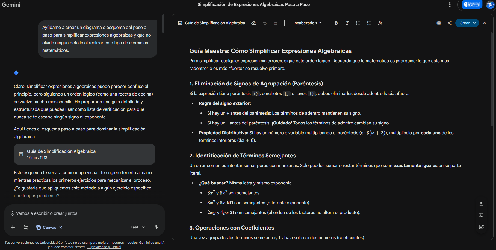
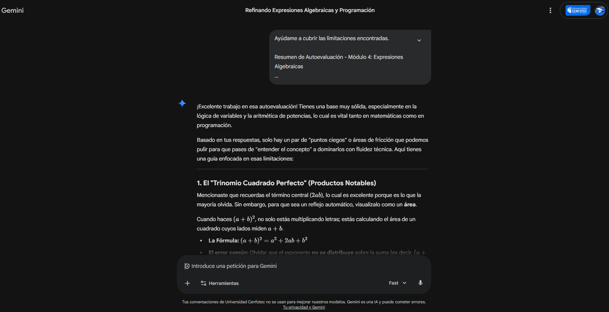

# Semana 6 – Autoevaluación AI-Mirror
## Módulo 4. Expresiones algebraicas (Parte I)

---

## Indicación

Responder las preguntas metacognitivas que aparecen en el IA-Mirror del AI Studio en el módulo correspondiente. Posteriormente, analizar los resultados obtenidos y reforzar los aspectos con menor dominio utilizando la Gema de DiálogoX.

---

## Respuesta

En la autoevaluación identifiqué que tengo una buena comprensión general de las expresiones algebraicas y sus procedimientos básicos, noté que en algunos casos debo prestar más atención al manejo de signos y para reforzar estas áreas utilicé la Gema de DiálogoX la cual me ayudó a comprender mejor el paso a paso para simplificar expresiones y evitar errores comunes.

---

## Evidencia

